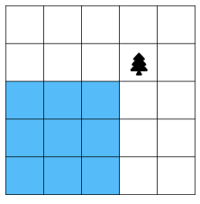
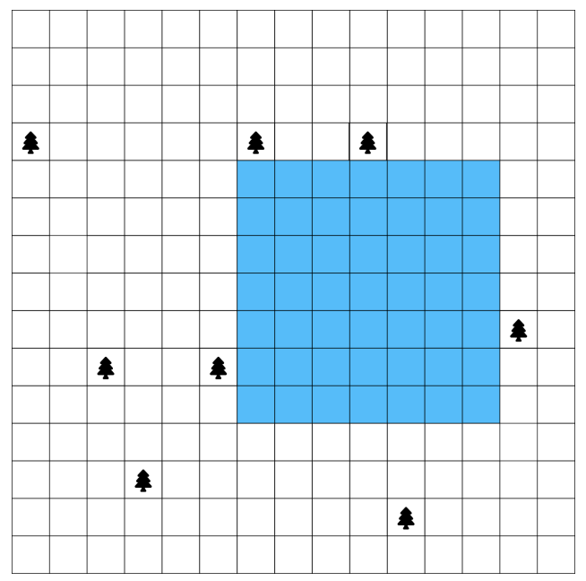

# Square Pool

**Problem Description**

Ron wants to build a square pool in his square N-by-N yard, but his yard contains T trees.
Your job is to determine the side length of the largest square pool he can build.

**Input Specification**

The first line of input will be an integer N with N ≥ 2. The second line will be the positive
integer T where T < N<sup>2</sup>. 

The remaining input will be T lines, each representing the location
of a single tree. The location is given by two positive integers, R and then C, separated by
a single space. Each tree is located at row R and column C where rows are numbered from
top to bottom from 1 to N and columns are numbered from left to right from 1 to N. No
two trees are at the same location.

**Output Specification**

Output one line containing M which is the largest positive integer such that some M-by-M
square contained entirely in Ron’s yard does not contain any of the T tree.

**Sample Input 1**
```
5
1
2 4
```

**Output for Sample Input 1**

```
3
```

**Explanation of Output for Sample Input 1**

A picture of the yard is below. The location of the tree is marked by a tree symbol and one of several
3-by-3 squares that do not contain the tree is highlighted. All larger squares contain a tree



**Sample Input 2**
```
15
8
4 7
4 1
14 11
10 6
13 4
4 10
10 3
9 14
```

**Output for Sample Input 2**

7

**Explanation of Output for Sample Input 2**

A picture of the yard is below. The location of each tree is marked by a tree symbol and one of several
7-by-7 squares that do not contain a tree is highlighted. All larger squares contain a tree.



